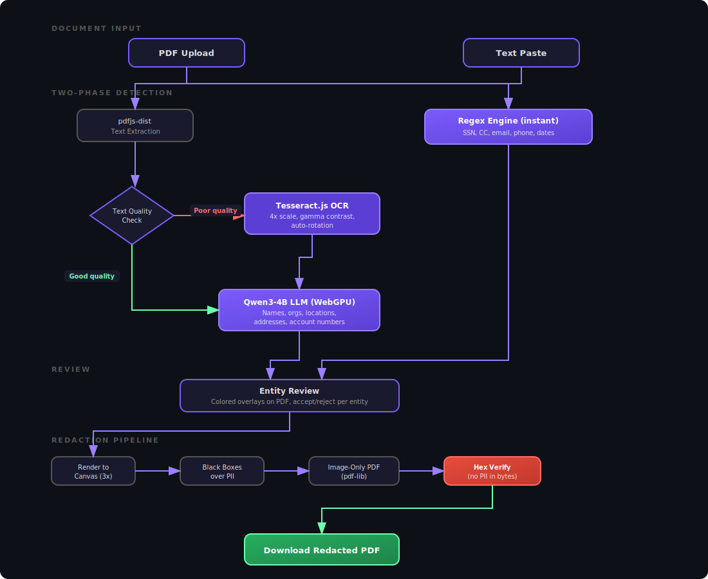

# LocalRedact

**Edge AI document redaction. Entirely in your browser.**

Detect and redact PII from PDFs and text — names, SSNs, addresses, dates, phone numbers, emails — using a 4B parameter LLM running on your GPU via WebGPU. No uploads. No servers. Your document never leaves your device.

**Live at [redact.mmostagirbhuiyan.com](https://redact.mmostagirbhuiyan.com)**

## How It Works

1. **Drop** a PDF or paste text
2. **Detect** — regex runs instantly, then Qwen3-4B scans for names, orgs, locations, addresses
3. **Review** — accept or reject each detection with colored overlays on the actual PDF
4. **Redact** — black boxes destroy the original content (render-to-image, no text survives)
5. **Download** — clean PDF with hex-verified redaction

## Features

- **Two-phase detection** — regex (instant) + LLM (deep scan) for comprehensive PII coverage
- **True PDF redaction** — render-to-image pipeline, not visual overlays. Original text is destroyed.
- **OCR fallback** — Tesseract.js extracts text from scanned/image-only PDFs with auto-rotation for sideways scans
- **Batch processing** — drop multiple files, apply category rules, redact-and-next workflow
- **Edit-distance matching** — handles OCR/LLM text mismatches (e.g., "BHUICYAN" vs "BHUIYAN")
- **Hex verification** — scans output PDF bytes for leaked PII strings
- **Confidence scoring** — computed from match quality (exact=0.95, fuzzy=0.80, regex=1.0)
- **Comparison view** — side-by-side before/after
- **Redaction report** — downloadable entity breakdown by category and detection source

## Tech Stack

| Layer | Technology |
|-------|-----------|
| Framework | React 18 + TypeScript + Vite |
| Styling | Tailwind CSS v4 (PostCSS) |
| AI Model | Qwen3-4B-q4f16_1-MLC (~2.5GB, WebGPU via WebLLM) |
| OCR | Tesseract.js v7 (WASM + WebWorker) |
| PDF | pdfjs-dist (parsing) + pdf-lib (output) |
| Hosting | Cloudflare Pages (static) |

## Requirements

- Desktop browser with WebGPU support (Chrome 113+, Edge 113+, Safari 17+)
- ~4GB GPU VRAM (any Apple Silicon Mac, any discrete GPU)
- First model load ~30s, cached after

## Development

```bash
npm install
npm run dev      # Dev server
npm run build    # Production build
npm run test     # 80 tests
```

## Architecture



## License

MIT
